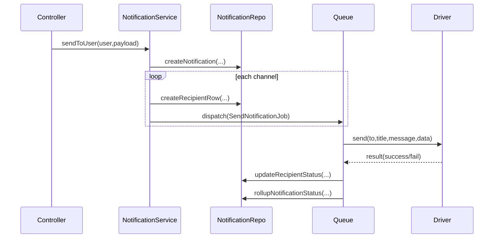
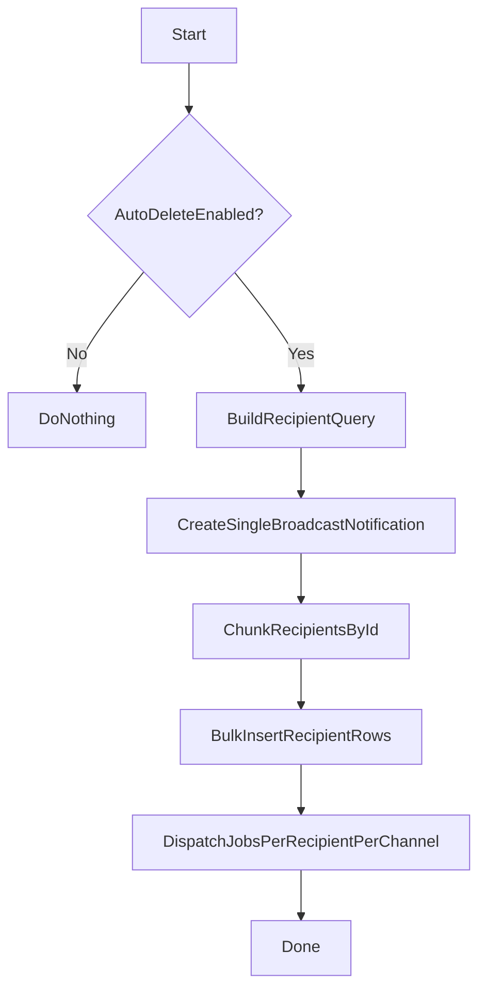

## Overview

This package is a clean-architecture reference for `backend/Modules/Notification`.

### Layers

- **Domain**: concepts only (no IO)
- **Application**: use-cases and ports (interfaces)
- **Infrastructure**: concrete adapters (drivers, repositories, queue)
- **Presentation**: shaping outputs (resources/DTOs)

### Flow (send to user)

### Flow (broadcast chunked)

### Mapping to real code (backend)

- Orchestration: `Modules/Notification/App/Services/NotificationService.php`
- Job execution + status rollup: `Modules/Notification/App/Jobs/SendNotificationJob.php`
- Laravel Notification channel bridge: `Modules/Notification/App/Channels/ModulesNotificationChannel.php`
- Pruning decision + image cleanup: `Modules/Notification/App/Models/Notification.php`

