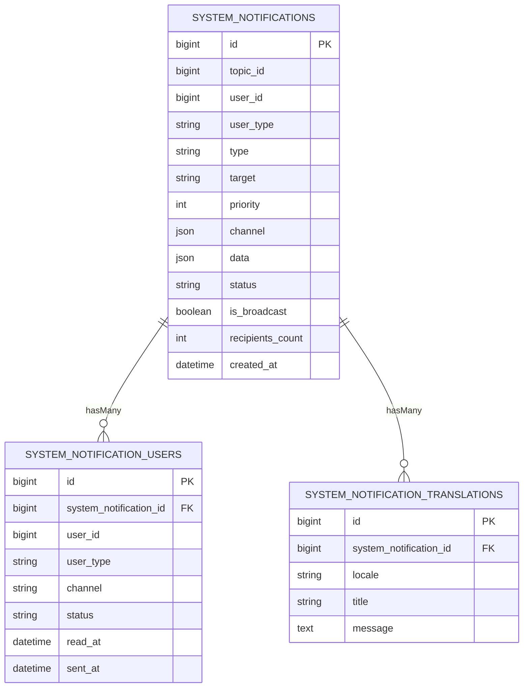

## Data model

This mirrors the intent of:

- `system_notifications`
- `system_notification_users`
- `system_notification_translations`

### Tables

### Important invariants

- One broadcast notification row for an audience, and N recipient rows (per user x channel).
- Recipient rows are unique per `(notification_id, user_id, user_type, channel)`.\n
